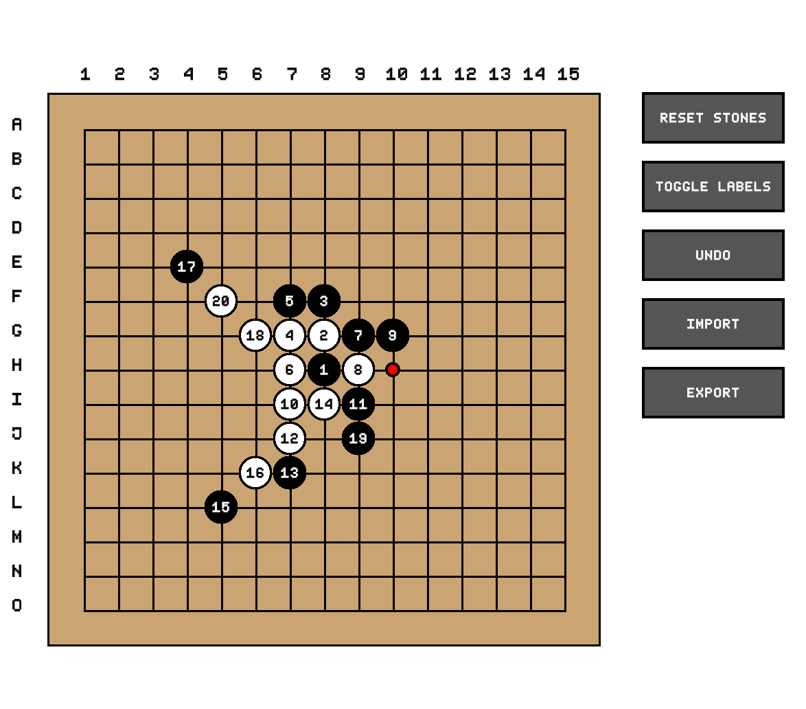

# Gomoku



### How to build the project
It is required to have FreeType library downloaded to build the program. <br>
If it is not installed on your device (Mac), Execute the following command in the terminal.
```
brew install freetype
```

1. Create a build folder 
```
mkdir build
```
2. Go into the build folder
```
cd build
```
3. Setup CMake in the build folder
```
cmake ..
```
4. Compile and link the project with CMake
```
cmake --build .
```
5. Run the Gomoku executable
```
./Gomoku
```
